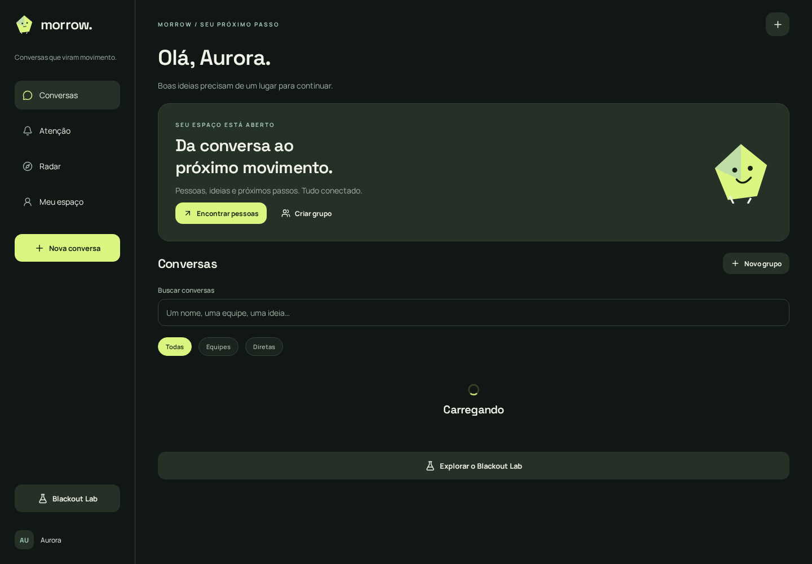
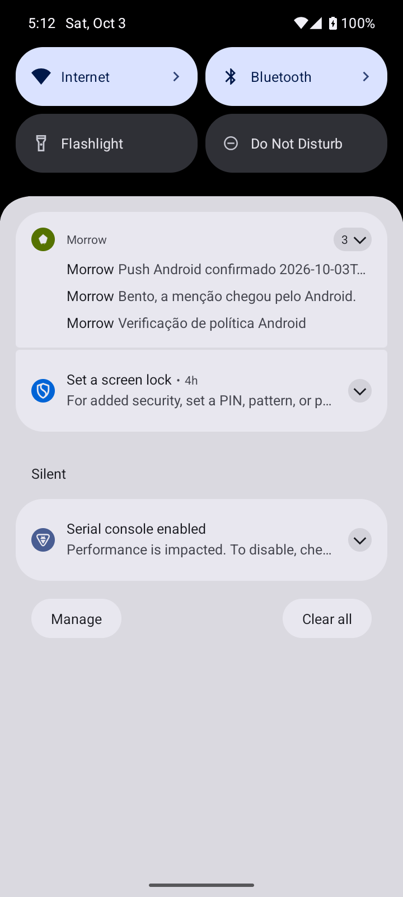

# Morrow

**FIAP · Mobile Development and IoT · CheckPoint 5 · 3ESPW**

| Integrante | RM |
| --- | --- |
| João Marcelo Furtado Romero | RM555199 |
| Matheus Rivera Montovaneli | RM555499 |
| André Nakamatsu Rocha | RM555004 |

Conversas que viram movimento. Aplicativo novo em **Expo SDK 57, React Native e TypeScript**, com chat Firebase, API própria HTTPS e dezesseis recursos adicionais. Marca original: grafite, cítrico, Manrope, Space Grotesk e o companheiro geométrico Kite.

- **Aplicação:** https://morrow-cp5.vercel.app
- **API:** https://morrow-cp5.vercel.app/api ([health](https://morrow-cp5.vercel.app/api/health))
- **Código:** https://github.com/gh-johnny/morrow-cp5
- **APK Android:** [baixar v1.0.0](https://github.com/gh-johnny/morrow-cp5/releases/download/v1.0.0/morrow-android.apk)
- **iOS simulator:** [baixar para macOS](https://github.com/gh-johnny/morrow-cp5/releases/download/v1.0.0/morrow-ios-simulator.tar.gz)
- **Builds:** https://expo.dev/accounts/beo-johnny/projects/morrow-cp5
- **Enunciado:** [Chat, Firebase, grupos e push](https://github.com/anderltda/doc-react-native/blob/main/CPS/3ESPW/Segundo%20Semestre/README_TRABALHO_REACT_NATIVE_CHAT_FIREBASE_GRUPOS_PUSH.md)

## Começar

Node.js 24+ e npm:

```bash
npm ci
npm --prefix server ci
cp .env.example .env.local
npm run web
```

O cliente usa a API publicada. `firebaseConfig.json` e `google-services.json` contêm a configuração pública real do projeto acadêmico **morrow-cp5-final-555199**. Credenciais administrativas ficam exclusivamente no servidor.

```bash
npm run build:apk
npm run build:ios
npm run verify
```

**Use build nativo para Android/iOS:** WebRTC e SQLCipher exigem módulos que não estão no Expo Go. O perfil EAS `preview` gera APK; `simulator` gera iOS para simulador macOS.

## Recursos

Chat direto único; grupos com capacidade concorrente; menções; quatro políticas push; mídia autorizada; perfis privados. Extras: Kite com fontes, áudio pesquisável, tarefas/Kanban, enquetes/agenda, threads, memória visual, canvas Yjs, radar, atenção, preferências, observatório push, Blackout Lab, convites QR/link, foco compartilhado, chamadas WebRTC e criptografia NaCl por dispositivo.

A arquitetura combina Firebase Auth, Firestore e RTDB com API Express/Firebase Admin na Vercel, Blob privado, Gemini e Expo Push. O nativo guarda fila e chaves com SQLCipher/SecureStore; o navegador usa IndexedDB/AES-GCM. Não usa Cloud Functions. Versões: **Expo 57.0.26 · React Native 0.86.3 · React 19.2.3**.

| Serviço | Responsabilidade |
| --- | --- |
| Firebase Auth | E-mail/senha, sessão e validação de identidade |
| Firestore | Perfis privados, grupos, capacidade, tarefas, preferências e eventos push |
| Realtime Database | Mensagens persistidas, presença, canvas, foco e sinalização WebRTC |
| Expo Push / FCM | Entrega Android a partir da API; APNs depende das credenciais iOS |
| Vercel Blob privado | Fotos, áudios e arquivos; acesso por URL autorizada de curta duração |

## Configuração, API e segurança

O aplicativo já usa Firebase e API publicados. Para executar a API localmente: copie `server/.env.example` para `server/.env`, preencha as variáveis e execute `npm run api:dev`. Para publicar: configure essas variáveis na Vercel, use `PUBLIC_API_URL=https://SEU-DOMINIO/api`, ajuste `WEB_ORIGINS` e execute `npx vercel deploy --prod`. O professor usa a API existente, sem precisar publicar ou configurar servidor.

Variáveis do servidor: `FIREBASE_PROJECT_ID`, `FIREBASE_DATABASE_URL`, `FIREBASE_CLIENT_EMAIL`, `FIREBASE_PRIVATE_KEY`, `PUBLIC_API_URL`, `WEB_ORIGINS`, `BLOB_READ_WRITE_TOKEN`, `GEMINI_API_KEY`, `GEMINI_MODEL`, `GEMINI_FALLBACK_MODEL`, `CRON_SECRET`; opcionais `EXPO_ACCESS_TOKEN`, `TURN_URLS`, `TURN_SHARED_SECRET`. Valores secretos ficam no ambiente da hospedagem.

Fotos: crie um **Vercel Blob privado**, conecte-o ao projeto e configure `BLOB_READ_WRITE_TOKEN`. O app seleciona a imagem e envia seus bytes por `POST /api/media`; o banco guarda a URL da API. A API autoriza leitura e gera links temporários. [Configuração e limites](docs/DELIVERY.md#desenvolvimento-e-publicação).

```bash
curl -f https://morrow-cp5.vercel.app/api/health
```

| Endpoints principais | Função |
| --- | --- |
| `GET /api/health` | Disponibilidade do servidor e integrações configuradas |
| `/api/users` | Perfil, descoberta, preferências e dispositivos privados |
| `POST /api/conversations/direct` | Direta única, sem conversa consigo mesmo |
| `POST /api/conversations/groups`; `PATCH /api/conversations/:id` | Criação e administração pelo proprietário |
| `/api/conversations/:id/messages` | Persistência, consulta e ações de mensagem |
| `POST /api/media`; `GET /api/media/:id/link` | Upload e autorização de mídia |
| `POST /api/notifications`; `POST /api/notifications/ack` | Envio autenticado, recebimento e abertura |
| `/api/conversations/:id/notifications` | Observatório de entrega |
| `/api/conversations/:id/tasks`, `/polls`, `/memories`, `/board`, `/focus`, `/call`, `/ai` | Colaboração e integrações; detalhes na entrega técnica |
| `/api/invitations`; `POST /api/jobs/run` | Convites e worker privado com `CRON_SECRET` |

As rotas protegidas exigem `Authorization: Bearer <Firebase ID token>`. A API verifica o usuário, a mensagem e a participação atual; credenciais Admin nunca entram no cliente.

Políticas: `all_group_messages` notifica integrantes atuais, exceto remetente; `mentioned_members` seleciona apenas mencionados; `direct_messages_only` impede push daquele grupo; `disabled` desliga o envio. Menções continuam visíveis no histórico do grupo. Preferências pessoais podem reduzir o envio.

O proprietário conta no `memberLimit`. Alterações e admissões usam **transações Firestore**, inclusive a disputa pela última vaga; o limite nunca pode ficar abaixo da ocupação. [Regras Firestore](firestore.rules) e [regras RTDB](database.rules.json) restringem dados por identidade/participação e impedem escrita cliente nos registros autoritativos.

Android: instale o APK, permita notificações e use **Meu espaço → Ativar push neste dispositivo**. Envie com outra conta; tocar na notificação abre a conversa. FCM v1 está configurado no EAS. iOS: o build de simulador está disponível; push em iPhone exige Apple Developer, APNs e aparelho, conforme [passos documentados](docs/DELIVERY.md#push-android-e-ios).

Estrutura: `src/app` contém telas Expo Router; `src/features`, recursos; `src/services`, integrações e fila; `shared`, contratos/domínio; `server/src`, API; `api/index.ts`, entrada Vercel; `tests` e `e2e`, verificação; `docs`, entrega e evidências.

## Documentação e evidências

- [Entrega técnica](docs/DELIVERY.md): requisitos, matriz dos 16 extras, políticas, configuração, segurança, testes e limitações.
- [Escopo aceito e critérios](docs/IMPLEMENTATION.md).
- [Evidências](docs/evidence): interface e integrações reais.

A API pública passou no teste com Auth real, concorrência, autorização, idempotência, colaboração e IA. Os testes de navegador verificam offline/reabertura, colaboração, criptografia e WebRTC real. Push Android teve entrega FCM confirmada e abertura da conversa pelo toque. O APK final passou no upload de áudio gravado, recuperação após reinício e reprodução a 2×. Android ↔ Chromium transmitiu vídeo WebRTC; biometria foi exercitada com impressão digital virtual. [Evidência nativa](docs/evidence/native-verification.json). Push iOS depende de Apple Developer/iPhone, indisponíveis nesta entrega. TURN está implementado como configuração opcional e ainda não provisionado no ambiente público.



Tela executada em Chromium/Playwright, com Firebase real. [Chat](docs/evidence/chat-desktop.png), [canvas](docs/evidence/canvas-desktop.png), [chamada](docs/evidence/webrtc-desktop.png) e [Android](docs/evidence/android-home.png).



Push real em segundo plano: mensagem direta, menção explícita e mensagem geral. Captura ADB, Android Emulator API 35 com Google Play Services, 2026-10-03. [Políticas verificadas](docs/evidence/push-policies.json).

Para contribuir: leia a entrega técnica, mantenha as regras e contratos tipados, execute `npm run verify` e os testes de regras antes de alterar autenticação ou autorização. Nunca versione `.env`, contas QA ou chaves administrativas.
